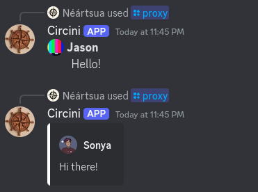

# circini
 
Small bot to allow pseudo-proxying in Discord DMs using embeds or custom emojis. 

## Usage

### Quickstart
- Authorize the bot on your USER PROFILE, *NOT* A SERVER. Link [here](https://discord.com/oauth2/authorize?client_id=1221503250616946831).
- Go to your DMs and start a DM with the bot.
- Run `/system create` to set up a new system.
- Run `/member add` to add a member.
- You should now be able to go into any DM channel and run the proxy command `/proxy`. Input the member proxy and message, then send!
- Done! You can add more members and edit their properties using commands below.

### Commands
All commands:

/help - basic info, etc. 
/system create - create a new system 
/system name - rename system 
/system delete - delete your system and all member data 
/member add - add a new member to the system 
/member name - change a member's name 
/member avatar - change a member avatar 
/member color - change a member's embed color 
/member proxy - change a member's proxy 
/member delete - delete a member 
/view system - see your entire member list 
/view member - see a specific member of your system 

### Emoji icons
Circini can send messages in a slightly more condensed format than embeds by using custom emojis as member icons instead. Circini automatically defaults to using embeds if the avatar is a URL, and condensed if the avatar is a custom emoji.

To use the condensed format, upload the emoji to your server, then *while in the server,* type a backslash (`\`) and then the emoji name. No spaces.

Discord will automatically give you the emoji ID when you press enter.

Run `/member avatar` and paste the custom emoji ID into the avatar field.

**NOTE THAT IN ORDER TO USE A CUSTOM EMOJI, CIRCINI MUST BE IN THE SERVER THE EMOJI IS FROM, EVEN IF YOU'RE ONLY USING CIRCINI IN DMs.**

# Support/Contact
If you're running into issues, you can find me on Discord @neartsua! (Support server [here](https://discord.gg/u3zB6z4bkC). It's small, but you can at least contact me there.)
